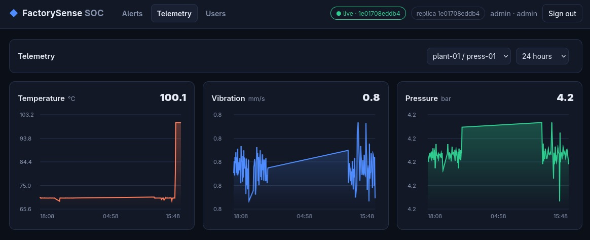
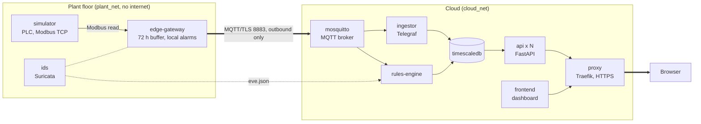

# FactorySense



Industrial IoT monitoring on a hybrid edge/cloud architecture. A simulated machine (PLC) produces
temperature, pressure and vibration; an edge gateway reads it and sends the data to the cloud over
MQTT/TLS; the cloud stores it, raises equipment and intrusion alerts, and shows them in a
web dashboard. Everything runs with Docker Compose.

The goal was to build a small SIEM for the plant. Events from the network (Suricata) and from the
machines (sensor thresholds, the gateway's own alarms) end up in one place. From there an analyst
can see what is happening and respond to an incident by acknowledging it, following it and
resolving it.

## Architecture



The edge gateway is the only container on both networks, and it opens no port: the plant only
connects outward. A more detailed diagram is in [`docs/architecture.mmd`](docs/architecture.mmd).

| Service | What it does | Technology |
|---|---|---|
| `simulator` | Fake PLC with three sensor registers; normal mode or a fault scenario (overheating, vibration, pressure) | Python, pymodbus |
| `edge-gateway` | Reads the PLC every second, runs a local overheating alarm, stores every message in SQLite and replays it when the broker is reachable | Python, paho-mqtt, SQLite |
| `ids` | Network IDS on the gateway's interfaces (Modbus writes, scans, probes, floods) | Suricata |
| `mosquitto` | MQTT broker: TLS only, one account per service, topic ACL | Mosquitto |
| `ingestor` | Validates each reading and inserts it with its original timestamp | Telegraf + Starlark |
| `timescaledb` | Telemetry hypertable with hourly rollup (30 d raw, 365 d rollup), alerts, users | PostgreSQL + TimescaleDB |
| `rules-engine` | Turns telemetry, gateway alarms and IDS events into alerts | Python |
| `api` | REST + WebSocket for alerts, telemetry and users; stateless, scalable | FastAPI |
| `frontend` | Dashboard: live alert feed, KPIs, charts, user admin | HTML/CSS/JS on nginx |
| `proxy` | Single public entry point: HTTPS, security headers, rate limits, load balancing | Traefik |

## Quick start

Requirements: Docker with Compose v2, ports 80 and 443 free.

```bash
cp .env.example .env
docker compose up -d --build --wait
docker compose ps        # 10 services healthy; mqtt-certs "Exited (0)" is expected
```

Open https://localhost, accept the self-signed certificate and sign in as administrator:

| User | Password |
|---|---|
| `admin` | `change-me-admin-password` |

The template contains public demo credentials. Replace the passwords in your local `.env` before
any real deployment; `.env` is ignored by Git.

These are the demo values of `ADMIN_USERNAME` / `ADMIN_PASSWORD` in `.env.example`. More users can be created
in the **Users** tab. API docs: https://localhost/api/docs.

`docker compose down` stops the stack and keeps the data; `docker compose down -v` resets everything.

## Demos

All commands run from the repository root with the stack up.

**1. Machine failures.** See [Simulate failures](#simulate-failures): the PLC goes out of range
(temperature, vibration, pressure) or goes offline, and the SIEM raises an alert.

**2. WAN outage, no data loss.** Stop the broker: the gateway keeps reading and buffering. When the
broker comes back, the backlog is replayed and stored with the original timestamps.

```bash
docker compose stop mosquitto
docker compose ps edge-gateway     # still healthy
docker compose start mosquitto
```

**3. Attacks on the plant.** See [Simulate attacks](#simulate-attacks): nine commands, each one
raising an alert in the SIEM.

**4. Network isolation.** The PLC cannot reach the cloud (name resolution fails).

```bash
docker compose exec simulator python -c "import socket; socket.create_connection(('mosquitto', 8883), timeout=2)"
```

**5. Horizontal scaling.** Traefik spreads requests over three API replicas; the `replica` field
changes between responses and the session survives because it is stored in the database.

```bash
docker compose up -d --scale api=3 --wait && sleep 5
for i in $(seq 6); do curl -sk https://localhost/api/health; echo; done
docker compose up -d --scale api=1
```

## Design decisions

- **Store, then send.** The gateway writes every reading to SQLite before publishing and deletes it
  only after the broker acknowledges it (QoS 1). Up to 72 h survive a WAN outage or a restart.
  Delivery is at least once, so duplicates are possible.
- **Time comes from the edge.** Each message carries `ts` (collection time). Data replayed after an
  outage is stored, and its alerts are dated, when it was measured, not when it arrived.
- **Detection in two places.** The gateway raises its overheating alarm without the cloud (≥ 85 °C,
  clears < 80 °C), so it works offline and arrives on replay. The cloud rules check temperature,
  vibration and pressure independently, plus sensor silence (no data for 10 s).
- **Hysteresis.** Alerts open at one threshold and close at a lower one, so a value hovering at the
  limit keeps a single alert open instead of flapping every second.

| Metric | Warning | Critical | Resolves when |
|---|---|---|---|
| Temperature | 75 °C | 85 °C | < 73 °C |
| Vibration | 4 mm/s | 6 mm/s | < 3.5 mm/s |
| Pressure | — | outside 3.5–5.0 bar | back within 3.7–4.8 bar |

- **Live dashboard without polling.** A database trigger sends `NOTIFY` on every alert change; each
  API replica `LISTEN`s and pushes it over WebSocket.

## Security

**Encryption.** Traffic is encrypted wherever it crosses a trust boundary:

- **Plant → cloud:** the gateway publishes over MQTT/TLS (8883) and checks the broker's certificate.
  The ingestor and rules engine also read from the broker over TLS.
- **Users → website:** HTTPS through Traefik; plain HTTP only redirects to HTTPS.

Inside `cloud_net` (proxy → API and dashboard, services → database), traffic is plain HTTP and
plain PostgreSQL. This is a deliberate trust assumption: the internal cloud network is private and
only the cloud provider can access it. The plant link from the PLC to the gateway (Modbus) is not
encrypted either, because the protocol does not support it. It stays on the isolated plant network,
and Suricata watches it.

**Other controls:**

- **Network:** the plant network is internal; the gateway only connects outward and listens on no port.
- **MQTT:** TLS 1.2+ with certificate verification, a password per service, and an ACL (the gateway
  can only publish, the ingestor and rules engine can only read).
- **Web:** HTTPS only, strict CSP and security headers, rate limit of 5 logins/min per IP.
- **Accounts:** scrypt password hashes, server-side sessions in an `HttpOnly`, `Secure`,
  `SameSite=Strict` cookie, admin-only user creation.
- **Database:** the API uses a least-privilege role that can only change an alert's status fields.
- **IDS:** Suricata watches the plant network (see below).

## SIEM and intrusion detection

The dashboard works as a mini SIEM. It has one live feed for equipment alerts (source `equipment`)
and network alerts (source `ids`), with KPIs and filters by source, severity and status. The response
workflow is: an alert opens as **active**, an analyst **acknowledges** it (their name and the time are
recorded), and it is **resolved** by hand or automatically when the reading returns to normal.

Network events come from Suricata. It shares the gateway's network namespace, so it sees every
packet entering or leaving the plant on both networks. Its alerts go to `eve.json`; the rules engine
reads that file and turns each one into a SIEM alert. Suricata priority 1 becomes **critical**,
priority 2 **warning**. Repeated hits of the same rule between the same two hosts update one alert
and increase its counter, so a scan does not flood the feed.

The 13 rules are written for this plant ([`config/suricata/rules/local.rules`](config/suricata/rules/local.rules)):

| Threat | What triggers the alert | Severity |
|---|---|---|
| **PLC tampering** | Any Modbus write to the PLC (the gateway only reads) | critical |
| | Modbus diagnostic/restart command (function code 08) | critical |
| | PLC fingerprinting (function code 43, Read Device ID) | warning |
| | Malformed Modbus request (fuzzing) | warning |
| **Unauthorized access** | Connection attempt from the cloud into the plant | critical |
| | Ping from a device on the plant network | warning |
| | Port scan from the plant network (5+ SYN in 3 s) | critical |
| | SSH or Telnet attempt into the plant | critical |
| | DNS query from the plant (it has no reason to resolve names) | warning |
| **Data leak** | Plaintext MQTT on port 1883 (only TLS on 8883 is allowed) | critical |
| | Plant traffic heading outside the two project networks | critical |
| **Denial of service** | Modbus flood: 25+ requests in 2 s (the gateway polls once per second) | critical |
| | SYN flood against the plant: 30+ SYN in 3 s | critical |

### Simulate attacks

Paste these from the repository root with the stack up and the dashboard open. Each one shows up in
the feed within a couple of seconds. The `docker run` commands start a throwaway "rogue device"
plugged into the plant network. The `docker compose exec edge-gateway` commands act as a
compromised gateway.

```bash
# 1. Rogue device pings the gateway                         -> ICMP probe (warning)
docker run --rm --network factorysense_plant_net alpine:3.24 ping -c 2 edge-gateway

# 2. Rogue device scans 60 ports                            -> port scan + SYN flood (critical)
docker run --rm --network factorysense_plant_net alpine:3.24 sh -c 'for p in $(seq 1000 1060); do nc -z -w 1 edge-gateway $p; done'

# 3. Rogue device tries SSH                                 -> SSH/Telnet attempt (critical)
docker run --rm --network factorysense_plant_net alpine:3.24 nc -z -w 2 edge-gateway 22

# 4. Rogue device sends a DNS query                         -> DNS on the plant (warning)
docker run --rm --network factorysense_plant_net alpine:3.24 nslookup -timeout=2 google.com edge-gateway

# 5. Write to the read-only PLC                             -> PLC tampering (critical)
docker compose exec edge-gateway python -c "from pymodbus.client import ModbusTcpClient as C; c = C('simulator', port=502); c.connect(); c.write_register(0, 1)"

# 6. Fingerprint the PLC (function code 43)                 -> fingerprinting (warning)
docker compose exec edge-gateway python -c "from pymodbus.client import ModbusTcpClient as C; c = C('simulator', port=502); c.connect(); c.read_device_information()"

# 7. Send a diagnostic command (function code 08)           -> diagnostic command (critical)
docker compose exec edge-gateway python -c "from pymodbus.client import ModbusTcpClient as C; c = C('simulator', port=502); c.connect(); c.diag_read_diagnostic_register()"

# 8. Flood the PLC with 100 requests                        -> Modbus flood (critical)
docker compose exec edge-gateway python -c "from pymodbus.client import ModbusTcpClient as C; c = C('simulator', port=502); c.connect(); [c.read_input_registers(0, count=3) for _ in range(100)]"

# 9. Try MQTT without TLS (connection refused is expected)  -> plaintext MQTT (critical)
docker compose exec edge-gateway python -c "import socket; socket.create_connection(('mosquitto', 1883), timeout=2)"
```

### Simulate failures

The simulator has fault scenarios. Each one runs normally for 30 s, then pushes one metric out of
range until the threshold is crossed, and the alert appears in the feed with source `equipment`.
Run one scenario at a time and go back to `normal` before the next. Back to normal, every open
alert resolves by itself within a few seconds. The times below are measured from the moment the
command is run.

```bash
# 1. Overheating: temperature climbs to ~100 °C             -> High Temperature Warning (~40 s),
#                                                              Critical High Temperature + Edge local alarm (~60 s)
SIMULATION_SCENARIO=overheating docker compose up -d --no-deps simulator

# 2. Worn bearing: vibration climbs to ~7.8 mm/s            -> High Vibration Warning (~50 s),
#                                                              Critical High Vibration (~60 s)
SIMULATION_SCENARIO=vibration docker compose up -d --no-deps simulator

# 3. Leak: pressure drops to ~3.0 bar                       -> Critical Hydraulic Pressure Out of Range (~50 s)
SIMULATION_SCENARIO=pressure-drop docker compose up -d --no-deps simulator

# 4. Blocked line: pressure rises to ~5.7 bar               -> Critical Hydraulic Pressure Out of Range (~50 s)
SIMULATION_SCENARIO=pressure-spike docker compose up -d --no-deps simulator

# 5. PLC goes offline                                       -> Sensor Silence / Loss of Signal (~15 s)
docker compose stop simulator
docker compose start simulator                              # data flows again and the alert resolves

# Back to normal after scenarios 1-4
SIMULATION_SCENARIO=normal docker compose up -d --no-deps simulator
```

The overheating alarm is raised twice on purpose. The gateway raises "Edge local alarm" by itself,
so it works even without the cloud, and the cloud rules engine raises its own alert from the
telemetry. Thresholds are in [Design decisions](#design-decisions).

### Check alerts from the terminal

The same alerts can be read and handled through the API with `curl`:

```bash
# Log in (stores the session cookie)
curl -sk -c /tmp/fs-cookie -H 'Content-Type: application/json' \
  -d '{"username":"admin","password":"change-me-admin-password"}' https://localhost/api/auth/login

# List the network alerts (attacks) and the equipment alerts (failures)
curl -sk -b /tmp/fs-cookie 'https://localhost/api/alerts?source=ids' | grep -o '"rule_name":"[^"]*"'
curl -sk -b /tmp/fs-cookie 'https://localhost/api/alerts?source=equipment' | grep -o '"rule_name":"[^"]*"'

# Acknowledge or resolve one (replace 1 with an alert id)
curl -sk -b /tmp/fs-cookie -X PATCH -H 'Content-Type: application/json' \
  -d '{"status":"acknowledged"}' https://localhost/api/alerts/1
```

To see what Suricata itself logged:
`docker compose exec ids grep -o '"signature":"[^"]*"' /var/log/suricata/eve.json`.

## Tests

```bash
# Gateway unit tests
docker compose run --rm --no-deps -T -v "$PWD/services/edge-gateway:/work/gateway:ro" \
  --entrypoint python edge-gateway -m unittest discover -s /work/gateway/tests -v

# Broker: TLS, authentication, ACL, persistence (uses its own throwaway containers)
docker compose build edge-gateway && python3 config/mosquitto/tests/run.py

# Ingestion: validation, old timestamps, database outage recovery (throwaway containers)
python3 config/telegraf/tests/run.py
```

## Repository layout

```
docker-compose.yml    all services, networks, volumes and healthchecks
.env.example          configuration template (demo values only)
.env                  local configuration (ignored by Git)
services/             our code: simulator, edge-gateway, rules-engine, api, frontend
config/               configuration for mosquitto, telegraf, timescaledb, suricata, traefik
docs/                 architecture diagram
```

## Limitations

- Traffic inside `cloud_net` (proxy → API, services → database) is not encrypted, and only the API
  has a restricted database role.
- The PLC accepts Modbus writes; the IDS detects them but does not block them.
